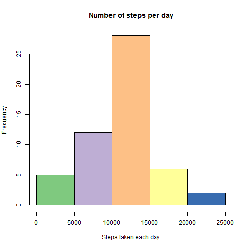
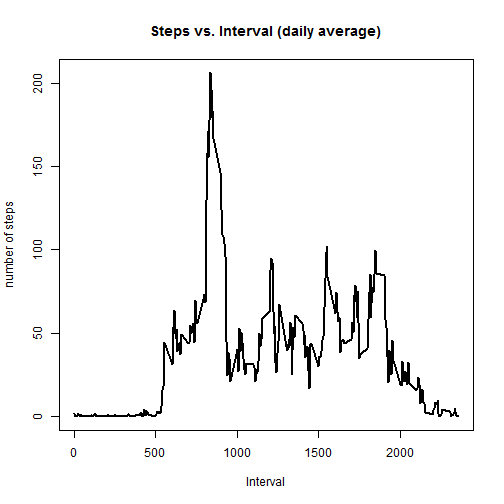
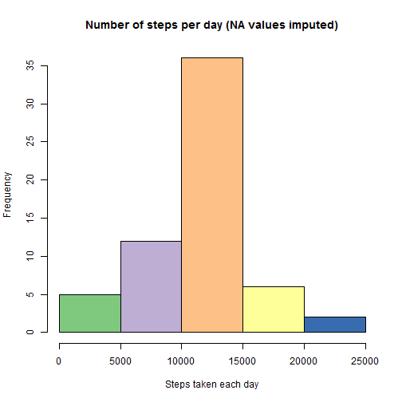
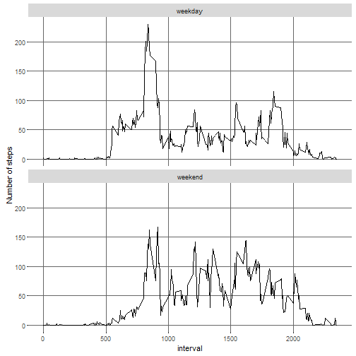

Reproducible Research week 2: Assignement 1
===========================================

* We first will install the neccesary packages to perform the assay plus change some options in the knitr options

```r
knitr::opts_chunk$set(echo = TRUE)
```

```r
library(ggplot2)
library(knitr)
library(RColorBrewer) #This one is to pimp the plots a bit :)
```

* The next step is to download the data to our present working directory **(set it with setwd() function first)** 

```r
# Download the file in the actual working directory if the file does not exists
fileURL <- "https://d396qusza40orc.cloudfront.net/repdata%2Fdata%2Factivity.zip"
if (!file.exists("./repdata%2Fdata%2Factivity.zip")) {
        download.file(fileURL, destfile = "./repdata%2Fdata%2Factivity.zip")
}
```

* The file is compressed in zip so we have to unzip it and load the data in R

```r
unzip("./repdata%2Fdata%2Factivity.zip")
activity <- read.csv("activity.csv")
```
No further processes/modifications will be done to the data yet (see below for later steps)

# And now to the point: The data analysis

1. Calculate the total number of steps taken per day and make and histogram of the total number of steps taken each day


```r
# Calculate the total number of steps taken per day
stepsday <- with(activity, tapply(steps, date, sum))

# Histogram of the total number of steps taken each day
hist(stepsday, main = "Number of steps per day", xlab = "Steps taken each day", col = brewer.pal(6, "Accent") )
```



2. Calculate and report the mean and median of the total number of steps taken per day


```r
# Mean and median number of steps taken each day (these variables are nice for plotting but not actual show raw numbers)
stepsmean <- with(activity, tapply(steps, date, mean, na.rm = TRUE))
stepsmedian <- with(activity, tapply(steps, date, median, na.rm = TRUE))

# Reporting mean 
mean(stepsday, na.rm = TRUE)
```

```
## [1] 10766.19
```

```r
# Reporting the nmedian
median(stepsday, na.rm = TRUE)
```

```
## [1] 10765
```

3. Time series plot of the average number of steps taken


```r
# Average number of steps taken in the 5-minute interval
stepsinterval <- aggregate(steps ~ interval, data = activity, mean, na.rm = TRUE)
```

```r
# Time for ploting the results
plot(steps ~ interval, data = stepsinterval, type = "l", lwd = 2, main = "Steps vs. Interval (daily average)", 
     ylab = "number of steps", xlab = "Interval")
```



5. The 5-minute interval that, on average, contains the maximum number of steps


```r
# Which 5-minute interval, on average across all the days in the dataset, contains the maximum number of steps?
stepsinterval[which.max(stepsinterval$steps), ]
```

```
##     interval    steps
## 104      835 206.1698
```

So we clearly see that ot is the interval **835** containing the maximun number of steps **206**

6. The strategy for filling in all of the missing values in the dataset used in this analysis

*But first lets see how many NA values we can find in the **steps** variable*


```r
# Total number of missing values in the dataset
sum(is.na(activity))
```

```
## [1] 2304
```


```r
#Filling the blanks (NA data)
activityNAfilled <- activity # Make a new dataset with the original data
for (i in 1:nrow(activityNAfilled)) {
        if (is.na(activityNAfilled$steps[i])) {
                interval_value <- activityNAfilled$interval[i]
                steps_value <- stepsinterval[stepsinterval$interval == interval_value, ]
                activityNAfilled$steps[i] <- steps_value$steps
        }
}
```

7. Histogram of the total number of steps taken each day and Calculate and report the mean and median total number of steps taken per day.


```r
stepsdaynoNA <- with(activityNAfilled, tapply(steps, date, sum))

# Plot the histogram
hist(stepsdaynoNA, main = "Number of steps per day (NA values imputed)", xlab = "Steps taken each day", col = brewer.pal(6, "Accent") )
```



* Calculating the mean and median with the new data obtained after imputing the NA values from the original data


```r
# First the mean
mean(stepsdaynoNA)
```

```
## [1] 10766.19
```

```r
#...and now the median
median(stepsdaynoNA)
```

```
## [1] 10766.19
```

##### As you can see coth values are almost the same as the one calculated before (In case of **the mean is exactly the same**). This due to the fact that we filled the NA values with the mean values of the steps (see r chunk where the variable _stepsinterval_ was defined).

8. Panel plot comparing the average number of steps taken per 5-minute interval across weekdays and weekends.

* We will approach this in two steps, first we create a new variable call days 

```r
# Create a new factor variable in the dataset with two levels - "weekday" and "weekend" 
activityNAfilled[, "day"] <- weekdays(as.Date(activityNAfilled$date))
activityNAfilled$day[activityNAfilled$day %in% c("lördag", "söndag")] <- "weekend"
activityNAfilled$day[activityNAfilled$day != "weekend"] <- "weekday"
# Changing to date to factor so we can print it in a decent way in the plot
activityNAfilled$day <- as.factor(activityNAfilled$day)
activityfinal <- aggregate(steps ~ interval + day, data = activityNAfilled, mean)
```

* And second we use ggplot2 to plot this nice results


```r
g <- ggplot(activityfinal, aes(interval, steps))
p <- g + geom_line() + facet_wrap(~day, ncol = 1) + 
        labs(y = "Number of steps") + 
        theme(panel.background = element_rect(fill = "white"), 
              panel.grid.major = element_line(colour = "grey40"))
print(p)
```



* Since the _intermediate_ (.md extension) is not kept after knitr is run in R studio we created it manualy using the knitr packcage (results will be not showed here but the **PA1_template.md** files is in the repository)

